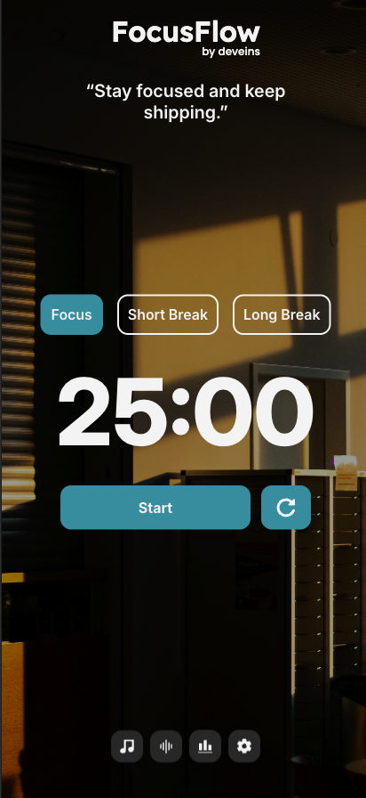

# 🎯 FocusFlow

**Your Ultimate Productivity Timer App**

FocusFlow is a minimal, elegant, and functional Pomodoro-based timer app designed to help you stay focused and get work done. With customizable focus/break sessions, themes, and alert sounds, it’s the perfect tool for deep work, study, other tasks and creative flow.

---

## 🚀 Features

- 🕰 **Focus, Short Break & Long Break Modes**  
  Switch between productivity modes with a single click.

- 🔧 **Custom Session Durations**  
  Fine-tune how long each session lasts to match your workflow.

- 🎨 **Dynamic Theme Selection**  
  Choose from 8 immersive themes to create your ideal work environment.

- 🔊 **Selectable Alert Sounds**  
  Get notified with clean audio cues — pick the sound that motivates you most.

- 📊 **Insightful Focus Statistics**  
  Track your **completed sessions, total focus time, break time, streaks**, and **daily progress bars** — all in a beautifully designed stats panel that helps you visualize your discipline.

- 💬 **Motivational Quotes Engine**  
  Start each session with handpicked motivational or inspirational quotes.

- ⚙️ **Comprehensive Settings Panel**  
  A sleek sidebar for managing timers, themes, quotes, and sounds — all in one place.

---

## 📸 Preview




---

## 🛠 Built With

- **HTML5**
- **SCSS** 
- **JavaScript (ES Modules)**
- **Responsive Design**
- **LocalStorage** for theme and sound preferences

---

## ⚙️ How to Use

1. Clone the repository:

   ```bash
   git clone https://github.com/deveins/focusflow.git</file>